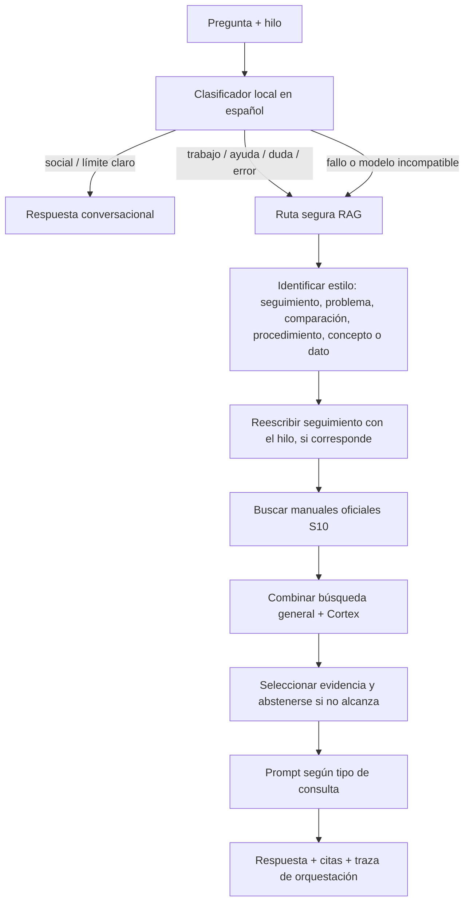

# Orquestación de Metrín

Estado: primera capa explícita implementada en `metrin/internal/rag`.

## Flujo de una consulta

La similitud del clasificador es coseno, **no es una probabilidad calibrada**. El clasificador solo decide si es seguro evitar la búsqueda documental para charla social o un límite claro. No debe decidir hechos, escoger una respuesta técnica sin evidencia ni activar acciones del ERP. Si falla, si no está cargado o si cambia el fingerprint del embedding, se usa RAG.

## Capas y categorías

| Capa                     | Valores                                                                                                    | Responsable                                                 |
| ------------------------ | ---------------------------------------------------------------------------------------------------------- | ----------------------------------------------------------- |
| Intención conversacional | `social`, `ayuda`, `limite`, `trabajo`                                                                     | kNN local sobre `potion-es-int8` + reglas léxicas de charla |
| Tipo de consulta técnica | `procedimiento`, `concepto`, `comparacion`, `problema`, `seguimiento`, `aclaracion`, `informacion_directa` | Reglas explícitas en español; no invoca otro modelo         |
| Ruta                     | `conversacion`, `rag`, `regla`                                                                             | Orquestador Go                                              |
| Forma final              | `conversacional`, `tutorial`, `respuesta`, `sin_contexto`, etc.                                            | RAG según la evidencia y el tipo de consulta                |

La API incluye `orquestacion` con intención, tipo de consulta, ruta, clasificador y similitud observada para poder revisar decisiones. El campo `modo` conserva su significado previo para no romper clientes.

## Política de fuentes

1. Cada consulta elegible busca manuales oficiales S10 (`confianza=oficial`) como conjunto propio; así una sección no desaparece solo por quedar fuera del top-K general.
2. Esos pasajes se combinan con resultados generales y Cortex. La autoridad desempata, pero una fuente no oficial mucho más relevante puede ganar; no se oculta el origen ni se inventa una respuesta.
3. Solo una pregunta procedimental con evidencia de tutorial o de una sección HTML oficial recibe el prompt extenso de pasos. Los conceptos no se convierten automáticamente en tutoriales.
4. Sin evidencia suficiente, el sistema se abstiene y conserva la consulta para revisión.

## Estado del clasificador y del entrenamiento

El artefacto actual no es un LLM pequeño afinado: es kNN sobre embeddings españoles locales, empaquetado en Go. Contiene 115 ejemplos en cuatro clases. Su evaluación documentada (validación 22/28, prueba 23/28) tiene apenas 28 textos por split; los fallos medidos cayeron a RAG, pero la muestra es demasiado pequeña para afirmar alta confiabilidad.

`data/preguntas/preguntas.jsonl` contiene 14.000 preguntas generadas desde Cortex con tipos `concepto`, `procedimiento`, `problema`, `dato`, `comparacion` y `contexto`; es útil para un experimento offline de tipo de consulta, pero **no son 14.000 mensajes reales de usuarios**. Las 56.000 variantes ortográficas sirven al retrieval, no deben contarse como conversaciones independientes. No se debe entrenar el LoRA conversacional con manuales ni usar pérdida de entrenamiento como prueba de exactitud.

**Decisión actual:** no hacer fine-tuning todavía. Primero ampliar la evaluación, separar por manual/nodo para evitar fuga de paráfrasis, probar falsos positivos que sacarían consultas técnicas del RAG, y recoger una muestra de preguntas reales anonimizadas y revisadas. Si esa evaluación demuestra confusiones sistemáticas en los tipos técnicos, entonces se entrena un segundo clasificador local sobre las etiquetas curadas del banco y se compara contra las reglas actuales. La decisión solo se promueve si mejora métricas por clase sin desviar preguntas técnicas.

## Calidad de la base oficial HTML observada

Reindexé el material descargado sin red y reconstruí el Metrín local. La KB
quedó con 1.314 filas JSONL: 466 fragmentos HTML por sección; 172 secciones
oficiales de `documentacion.s10peru.com`; 51 secciones oficiales incluyen
pasos con captura y contienen 153 referencias de imagen. Las 268 referencias
de captura revisadas apuntan a archivos existentes. El servidor local cargó
6.093 trozos.

Hay 60 HTML huérfanos con la marca del muro de miembros, pero al cruzarlos con
`data/paginas.jsonl` ninguno corresponde a una fila indexada. El indexador
omite páginas marcadas con `muro_de_miembros`; esa protección se conserva.
Sigue pendiente un caso importante: el HTML guardado de `Manual de Gerencia de
Proyectos` contiene el armazón del sitio y no el cuerpo del manual; su `.md` sí
contiene el texto extenso, pero todavía se parte por tamaño y no por sección.
No contar ese manual como cubierto por el nuevo filtro por secciones.

## Verificación

Los cambios de orquestación pasan `go test ./...` en `metrin/`. Para comprobar la conducta en una imagen local, reconstruir el servicio Metrín después de que se regenere la KB y confirmar `/health`, `orquestacion`, citas oficiales y respuestas con pasos junto a una captura conocida.
