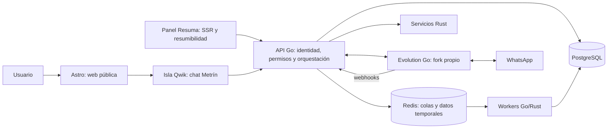

# Plan de implementación: plataforma y chat de Metrín

## 1. Objetivo

Construir una plataforma dockerizada para un asistente de ERP de construcción. La web pública se sirve con Astro y el chat embebible usa una isla Qwik. El panel administrativo del bot se construye con Resuma en Rust para usar resumibilidad nativa. Go coordina la aplicación y sus reglas de negocio; servicios Rust cubren APIs y tareas donde aporten una ventaja concreta. PostgreSQL conserva la información, Redis gestiona colas y estados temporales, y un servicio separado integra WhatsApp mediante el fork propio de Evolution Go.

El nombre del asistente en producto es **Metrín**. La interfaz y sus respuestas usan español neutro, sin regionalismos ni jerga.

## 2. Decisiones de arquitectura

| Área | Decisión inicial | Motivo y límite |
|---|---|---|
| Contenedores | Docker Compose para desarrollo y una imagen por servicio | Facilita levantar el sistema completo y reemplazar componentes de forma independiente. Kubernetes no forma parte de la primera etapa. |
| Web pública y composición | Astro | Renderiza páginas y composición de interfaz con JavaScript de cliente solo en los componentes interactivos. |
| Chat interactivo | Qwik mediante `@qwik.dev/astro` | Se carga como isla dentro de Astro. En esta integración se usan las APIs de Astro para rutas y datos; Qwik City no sustituye a Astro. |
| Panel administrativo del bot | Resuma (Rust) | Resumibilidad SSR nativa es requisito. La documentación del proyecto describe un loader/runtime de navegador de ~1 KB, con handlers diferidos; medir el panel completo y validar madurez antes de producción. |
| CSS | Tailwind CSS v4 | Elección única para Astro/Qwik. Compilar para el panel Resuma con Tailwind CLI desde sus plantillas Rust hasta confirmar integración compatible; no instalar Tailwind y UnoCSS en la misma app. |
| Gluon | Fuera de producción inicialmente | Es una alternativa experimental basada en Custom Elements. Evaluarla en un prototipo aislado y con pruebas propias antes de considerar una migración. |
| Backend de aplicación | Go | API pública, autenticación, permisos, orquestación y reglas centrales del producto. |
| Servicios especializados | Rust | Servicios separados con límites claros; usarlo donde el perfil de rendimiento, concurrencia o seguridad de memoria lo justifique. |
| API entre servicios | HTTP/JSON para el borde; gRPC/Protobuf solo para llamadas internas estables y de alto volumen | Evita introducir dos protocolos en cada flujo. Elegir por servicio y documentarlo. |
| Base de datos | PostgreSQL | Fuente de verdad para usuarios, conversaciones, configuración, auditoría y referencias a datos del ERP. |
| Cola y estado temporal | Redis | Transporte de trabajos asíncronos, bloqueos breves y datos efímeros. No usar Redis como fuente de verdad. |
| WhatsApp | Fork `davrv93/evolution-go`, en contenedor aislado | Integración por API y webhooks. Fijar una versión o commit y comprobar las rutas, autenticación y eventos reales del fork antes de implementar el adaptador. |
| Animación general | Motion | Usar la API JavaScript de `motion` para transiciones generales entre Astro, Qwik y Resuma. La API `motion/react` queda limitada a componentes React existentes. |
| Mascota de Metrín | Rive (`@rive-app/canvas`) | Animaciones de la mascota (parpadeo, mirada, asentir, reacción breve). Runtime JS+WASM ≈200 KB gzip (≈3 MB sin comprimir) según el proyecto: medir el build real antes de fijar; cargar bajo demanda, precargar el WASM solo al crear la instancia y mantener fallback CSS accesible. |

Qwik mantiene integración con Astro y en ese caso se usan las APIs de Astro para routing y datos. El crate Resuma describe SSR y resumibilidad con handlers diferidos; su cifra de ~1 KB corresponde al loader/runtime que declara el proyecto, no al bundle total. Tailwind documenta su plugin Vite en Astro y Motion tiene API JavaScript y API React. Fuentes: [Qwik con Astro](https://qwik.dev/docs/integrations/astro/), [Resuma en docs.rs](https://docs.rs/resuma/latest/resuma/), [Tailwind v4 con Astro](https://tailwindcss.com/docs/installation/framework-guides/astro), [Motion para JavaScript y React](https://motion.dev/docs).

Decisión revisada (2026-10-01): `apple-motion-lite` quedó descartado porque no tiene publicación pública verificable (posible paquete interno u homónimo). La mascota usa Rive: runtime open source (github.com/rive-app/rive-wasm) con documentación oficial en rive.app/docs. Las cifras de tamaño son del proyecto y se confirmarán midiendo el bundle de producción antes de fijar la dependencia (ver §10).

La arquitectura de modelos, clasificación, RAG, Cortex, feedback, aprendizaje controlado, UI conversacional y contrato de respuestas está detallada en [ESPECIFICACION_IA_METRIN.md](ESPECIFICACION_IA_METRIN.md). Esa especificación prevalece sobre los prompts originales cuando exista conflicto con el nombre Metrín, el español neutro o el aprendizaje sujeto a validación humana.

### Resultados de rendimiento

Los números de benchmarks compartidos son hipótesis para validar, no requisitos ni garantías universales. Tailwind describe mejoras de hasta 5x en builds completos y más de 100x en builds incrementales frente a Tailwind v3; eso no significa que todos los builds sean 100x más rápidos. El repositorio de Gluon publica sus propias comparaciones y metodología; sus resultados no predicen el rendimiento del panel completo. Medir el bundle comprimido, interacción, memoria y carga en dispositivos objetivo antes de cambiar el stack. Fuentes: [anuncio de Tailwind v4](https://tailwindcss.com/blog/tailwindcss-v4), [evidencia y metodología de benchmarks de Gluon](https://github.com/marcmalerei/gluon).

## 3. Diagrama lógico



Redis no reemplaza a PostgreSQL. Los workers procesan con reintentos limitados e idempotencia. Evolution Go queda detrás de una interfaz adaptadora para que el dominio no dependa de sus rutas internas.

## 4. Límites entre servicios

### Go: API y orquestación

- Autenticación, autorización por organización/obra y límites de acceso.
- API versionada para web, panel y canales.
- Gestión de conversaciones, mensajes, sesiones y configuración de Metrín.
- Encolado de tareas, idempotencia, correlación de solicitudes y auditoría.
- Adaptadores para PostgreSQL, Redis y Evolution Go.
- No duplicar reglas de negocio en el frontend ni en Evolution Go.

### Rust: servicios de dominio especializado

- Cada servicio Rust debe tener una responsabilidad y un contrato explícitos.
- Empezar solo con los servicios que ya tengan una carga concreta: por ejemplo, procesamiento de documentos, extracción/normalización o cálculos intensivos.
- No crear un servicio Rust que replique toda la API Go.
- Publicar contrato OpenAPI para HTTP o Protobuf para gRPC. Versionar cambios incompatibles.
- Definir timeouts, límites de tamaño, reintentos y formato común de errores.

### Astro, Qwik, Resuma y React

- Astro maneja páginas públicas, layouts, renderizado y el montaje del chat Qwik.
- Qwik controla el estado y las interacciones del chat embebible; en Astro usa la integración `@qwik.dev/astro` y APIs de Astro para rutas/datos.
- Resuma sirve el panel administrativo separado y satisface el requisito de resumibilidad en Rust. Consumirá la API Go con contratos HTTP documentados; no duplicará dominio ni persistencia.
- React queda solo para componentes existentes o dependencias que lo exijan. No hidratar la misma zona con React y Qwik.
- Mantener panel Resuma y web Astro en subapps separadas: no se ha confirmado una integración oficial que monte Resuma como renderer de componentes Astro.
- Cargar historial de conversación de forma paginada; no enviar historial completo de manera automática.
- La interfaz debe contemplar estados: inicial, escribiendo, procesando, respuesta, error recuperable, desconectado y sesión expirada.

### Redis y trabajos

- Elegir una biblioteca mantenida por lenguaje antes de fijar el formato de la cola.
- Definir nombre de cola, payload versionado, máximo de intentos, backoff, timeout, dead-letter y política de deduplicación.
- Los mensajes de cola llevan identificadores y referencias; evitar incluir datos sensibles innecesarios.
- Una caída de Redis no debe perder datos confirmados en PostgreSQL. Usar patrón outbox cuando la escritura en base y la publicación de un evento deban ser consistentes.

### WhatsApp con Evolution Go

- Mantener Evolution Go en un contenedor separado y una red interna de Docker.
- Fijar el commit o tag desplegado; no seguir `latest`.
- Revisar el contrato real del fork: endpoints, mecanismo de autenticación, payloads, firma de webhooks y reconexión. No asumir rutas de Evolution API upstream.
- Validar autenticidad y repetición de webhooks, deduplicar eventos y registrar el identificador externo del mensaje.
- No exponer el panel administrativo ni credenciales de Evolution a Internet.
- Guardar credenciales en secretos del entorno de despliegue, nunca en imágenes, repositorio o logs.

## 5. Organización propuesta del repositorio

```text
metrin/
  apps/
    web/                    # Astro: páginas públicas y montaje del chat
    admin/                  # Resuma: panel administrativo del bot
  packages/
    chat-ui/                # isla Qwik en Astro
    contracts/              # OpenAPI, Protobuf y tipos generados
    design/                 # tokens, componentes y guías
  services/
    api-go/                 # API, autenticación y orquestación
    workers-go/             # trabajos asíncronos de aplicación
    rust/                   # servicios Rust independientes
    evolution-go/            # referencia al fork o instrucciones de imagen fijada
  infra/
    compose.yaml
    postgres/
    redis/
    observability/
  docs/
    architecture.md
    runbook.md
```

Si el fork de Evolution Go se mantiene en otro repositorio, no copiar su código al monorepo: fijar imagen por digest o commit, y documentar cómo se construye y actualiza.

## 6. Contratos iniciales

Diseñar y documentar estos recursos antes de conectar la interfaz:

- `POST /api/v1/conversations`: crear conversación con organización y contexto autorizado.
- `GET /api/v1/conversations`: listar conversaciones visibles para el usuario, con cursor y límite.
- `GET /api/v1/conversations/{id}/messages`: obtener mensajes paginados.
- `POST /api/v1/conversations/{id}/messages`: enviar mensaje con `client_message_id` idempotente.
- `GET /api/v1/conversations/{id}/events`: recibir progreso/respuesta por SSE. Evaluar WebSocket solo si se requiere comunicación bidireccional continua.
- `POST /api/v1/webhooks/evolution`: aceptar eventos autenticados, deduplicados y correlacionables.
- `GET /health/live` y `/health/ready`: separar proceso vivo de dependencias listas.

Cada operación valida identidad, organización, permisos y límites de tamaño. Los errores usan un esquema uniforme con `code`, `message`, `request_id` y campos seguros para el usuario.

## 7. Modelo de datos mínimo

- `organizations`: tenant/empresa y configuración.
- `users` y `memberships`: identidad y roles por organización.
- `conversations`: organización, usuario/canal, estado y fechas.
- `messages`: conversación, dirección, texto o referencia segura, estado y claves de idempotencia.
- `channel_accounts`: asociación protegida con cuenta/conexión de WhatsApp; secretos cifrados o administrados fuera de la base.
- `webhook_events`: id externo, proveedor, estado de procesamiento y fecha; unique constraint para deduplicar.
- `audit_events`: actor, organización, acción, recurso y metadatos no sensibles.
- `outbox_events`: eventos transaccionales pendientes de publicar a Redis.

Definir retención, borrado, índices y migraciones antes de guardar conversaciones reales. No almacenar tokens de sesión de WhatsApp en texto plano.

## 8. Contenedores y configuración

Compose de desarrollo debe incluir `web`, `admin`, `api`, workers requeridos, `postgres`, `redis` y Evolution Go solo cuando se trabaje con el canal WhatsApp. Cada servicio tendrá healthcheck, límites razonables, red interna y volúmenes nombrados donde corresponda.

- Usar imágenes multi-stage, usuarios no root, versiones fijadas y builds reproducibles.
- No publicar PostgreSQL, Redis ni Evolution Go en interfaces públicas por defecto.
- Mantener `.env.example` sin valores reales. Validar variables obligatorias al iniciar.
- Separar configuración local, pruebas y producción. Proteger datos reales y usar datos sintéticos localmente.
- Añadir logs estructurados con `request_id`, métricas de colas y latencia, y trazas entre servicios. Excluir contraseñas, tokens, contenido sensible y credenciales.

## 9. Plan por etapas y criterios de salida

### Etapa 0: decisiones y contratos

- Confirmar tenancy, roles, proveedor de identidad, fuentes de datos del ERP, dominios y entorno de despliegue.
- Revisar el fork Evolution Go y fijar su contrato y versión.
- Crear OpenAPI, esquema de eventos, ADR de frontend y ADR de cola.
- Definir navegadores, dispositivos objetivo y presupuestos de rendimiento.

**Salida:** ninguna ruta o payload de integración se basa en supuestos; cada servicio tiene responsable y frontera documentados.

### Etapa 1: esqueleto dockerizado

- Crear la estructura de carpetas, Dockerfiles multi-stage y Compose local.
- Levantar Astro, API Go, PostgreSQL y Redis con checks de salud.
- Levantar una app Resuma separada para el panel y fijar la versión de `resuma`/`resuma-macros`.
- Añadir migraciones y endpoint de salud.
- Configurar logs, formato, lint y builds reproducibles.

**Salida:** un comando documentado inicia el stack; servicios saludables se detectan y una caída de Redis/PostgreSQL aparece claramente. El build SSR de Resuma y su navegación de prueba funcionan dentro del contenedor.

### Etapa 2: identidad, permisos y datos

- Implementar organización/usuario/roles y aislamiento por tenant.
- Crear migraciones para conversaciones, mensajes, auditoría y outbox.
- Añadir operaciones de conversación y envío idempotente.

**Salida:** pruebas de autorización demuestran que un usuario no puede consultar datos de otra organización.

### Etapa 3: isla de chat Metrín

- Crear layout Astro y chat Qwik accesible con teclado y lector de pantalla.
- Crear el shell administrativo en Resuma y verificar que interacciones comunes se reanudan sin reejecutar toda la vista.
- Añadir estados de carga, reintento, error, desconexión y reconexión.
- Implementar SSE para el flujo inicial, cancelación y paginación.
- Añadir identidad visual de Metrín y estados semánticos para sus animaciones.
- Usar Motion para transiciones generales. Aislar Rive en el controlador de la mascota de Metrín después de medir el bundle; desactivar animaciones con `prefers-reduced-motion`.

**Salida:** el chat funciona con una API simulada y luego con Go; el JavaScript inicial y el tiempo hasta interacción quedan medidos en el dispositivo objetivo.

### Etapa 4: colas y servicios Rust

- Implementar outbox y worker con deduplicación, reintentos limitados y dead-letter.
- Añadir el primer servicio Rust con contrato versionado y métricas.
- Probar timeout, respuesta inválida y caída/reinicio de servicios.

**Salida:** los trabajos no se pierden tras reinicios y sus resultados no se aplican dos veces.

### Etapa 5: canal WhatsApp

- Construir el adaptador Go y desplegar el fork Evolution Go fijado.
- Configurar webhooks firmados o mecanismo equivalente confirmado en el fork.
- Asociar eventos entrantes a organización y conversación; controlar deduplicación y respuestas salientes.

**Salida:** mensajes entrantes y salientes se trazan extremo a extremo sin exponer credenciales ni aceptar webhooks repetidos como nuevos.

### Etapa 6: endurecimiento y operación

- Revisar permisos, gestión de secretos, copias, restauración, retención y auditoría.
- Añadir límites de tasa, protección contra abuso, alertas y panel operativo.
- Medir presupuesto de bundle, latencia p50/p95, fallos de cola, consumo de memoria y rendimiento del chat.
- Ejecutar pruebas de carga representativas y ensayo de restauración.

**Salida:** runbook de incidentes, restauración comprobada y umbrales de alerta acordados antes de producción.

## 10. Capa de animación

- **Motion:** transiciones de navegación y panel, cambios de layout, entrada/salida de mensajes y estados de carga. Preferir la API JavaScript `animate()`/`scroll()` para código compartido entre Astro, Qwik y Resuma; usar `motion/react` solo en una isla React.
- En Resuma, conectar Motion desde un módulo JavaScript del navegador sobre límites DOM explícitos; no asumir que callbacks externos se traducen automáticamente desde Rust mediante `rs2js`.
- **Mascota con Rive:** microinteracciones exclusivas de Metrín: parpadeo, mirada, asentir, reacción breve y pequeños movimientos de herramientas. Un archivo `.riv` por estado, encapsulado detrás de `MascotaMotionController` con métodos por estado (`idle`, `listening`, `thinking`, `success`, `error`) para reemplazar el motor sin cambiar el chat.
- Cargar el controlador de mascota bajo demanda, pausar cuando no esté visible y respetar `prefers-reduced-motion`. Evitar animar layout continuamente; priorizar `transform` y `opacity`.
- Antes de integrar Rive, medir el bundle real gzip/brotli del runtime JS+WASM con un prototipo mínimo en Astro/Qwik/Resuma y registrar versión, licencia (open source), mantenimiento y peso en la tabla de dependencias; solo entonces se fija la versión. Cargar el runtime bajo demanda y precargar el WASM solo al crear la primera instancia.
- Medir el bundle combinado con Motion. Motion y Rive tienen responsabilidades separadas y no deben controlar el mismo elemento o gesto.

## 11. Decisiones explícitas para evitar sobrecarga

- No combinar Tailwind y UnoCSS en el mismo frontend. Si se desea comparar UnoCSS, hacerlo en una rama/prototipo con las mismas pantallas y mediciones.
- No introducir Gluon en el panel principal hasta validar accesibilidad, herramientas, ecosistema de componentes, mantenimiento y bundle con una prueba de concepto.
- Rive solo para la mascota: Motion cubre las transiciones generales del chat. No usar Rive para el resto de la interfaz hasta medir el bundle y justificar otro uso concreto.
- No usar WebGPU para animaciones rutinarias del chat; reservarlo para una necesidad visual demostrable y con fallback. No es parte del MVP.
- No usar React y Qwik para implementar dos versiones de la misma isla.
- No crear servicios Rust “por si acaso”; cada servicio requiere una carga medida y una frontera de dominio.
- No fijar cifras de benchmark de terceros como SLA. Los SLA salen de pruebas repetibles en el hardware y red objetivo.

## 12. Riesgos y mitigaciones

| Riesgo | Mitigación |
|---|---|
| Complejidad por Go, Rust, Astro, Qwik, Resuma y React | Aislar Resuma al panel; limitar React a legado; Qwik solo al chat embebible; mantener contratos explícitos entre apps. |
| Resuma es joven o cambia API/compilación | Fijar versión, mantener prueba vertical de SSR/resumibilidad, revisar releases y conservar un plan de salida al mismo contrato Go. |
| Rive pesa demasiado o su WASM falla en un navegador objetivo | Medir bundle gzip/brotli antes de fijar la versión; cargar bajo demanda con precarga diferida del WASM, fijar el runtime y ofrecer fallback CSS con movimiento reducido. |
| Pérdida o duplicación de mensajes | Outbox transaccional, claves idempotentes, deduplicación de webhooks y pruebas de reinicio. |
| Cruce de datos entre empresas | Tenant derivado de identidad validada en backend; controles en cada consulta y pruebas negativas. |
| Cambios incompatibles del fork Evolution Go | Fijar commit/imagen, adaptador aislado, pruebas de contrato y procedimiento de actualización. |
| Redis considerado fuente de verdad | PostgreSQL conserva estado; Redis solo coordina trabajo temporal. |
| Runtime o animación pesa demasiado | Medir bundle y memoria en móvil; cargar la mascota bajo demanda y ofrecer movimiento reducido. |
| Benchmarks no reproducibles | Registrar herramienta, versión, hardware, navegador, dataset, muestras y p50/p95; comparar builds de producción equivalentes. |

## 13. Referencias técnicas

- [Qwik: integración con Astro](https://qwik.dev/docs/integrations/astro/)
- [Resuma: crate, arquitectura y modelo resumible](https://docs.rs/resuma/latest/resuma/)
- [Astro: componentes de frameworks e islas](https://v5.docs.astro.build/en/guides/framework-components/)
- [Tailwind CSS: instalación oficial en Astro](https://tailwindcss.com/docs/installation/framework-guides/astro)
- [UnoCSS: integración con Astro](https://unocss.dev/integrations/astro)
- [UnoCSS: plugin Vite](https://unocss.dev/integrations/vite)
- [Tailwind CSS v4: anuncio y resultados publicados por el proyecto](https://tailwindcss.com/blog/tailwindcss-v4)
- [Gluon: código y metodología de benchmarks del proyecto](https://github.com/marcmalerei/gluon)
- [Motion: documentación JavaScript y React](https://motion.dev/docs)
- [Rive: runtimes web y tamaños de runtime](https://rive.app/docs/runtimes/runtime-sizes)
- [Fork de Evolution Go indicado para el proyecto](https://github.com/davrv93/evolution-go)

Las versiones de frameworks, integración Astro-Qwik y paquetes de cola deben comprobarse y fijarse al iniciar cada etapa; este plan define arquitectura y contratos, no sustituye la validación de compatibilidad de versiones del momento.
