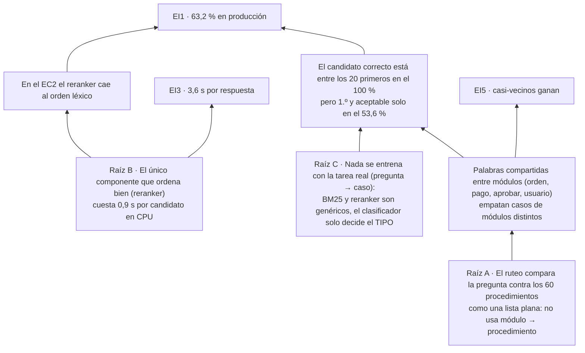
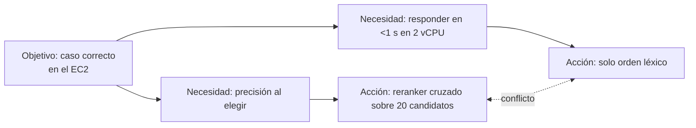
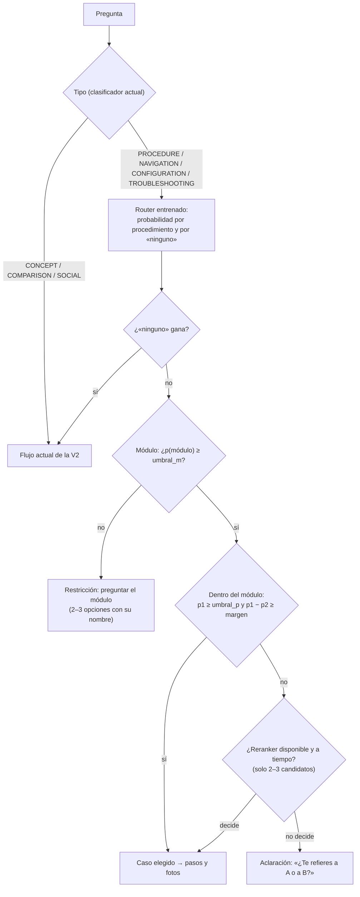

# Ruteo de Metrín al caso correcto: diagnóstico con Teoría de Restricciones

Fecha: 07-10-2026. Alcance: cómo la V2 de Metrín elige el procedimiento (el «caso del tutorial») que responde una
pregunta. Todas las cifras salen de mediciones ya documentadas; la fuente va al lado de cada una.

**Meta del sistema:** que cada pregunta de un usuario termine en el procedimiento correcto de `kb/procedimientos/`, con
sus pasos y fotos, dentro de un tiempo aceptable **en el EC2** (2 vCPU, sin GPU), o en una pregunta de aclaración cuando
de verdad hay dos casos posibles.

## 1. Árbol de la realidad actual

Efectos indeseables (EI), medidos:

| EI | Cifra | Fuente |
|---|---|---|
| EI1 · En producción una de cada tres preguntas de procedimiento no llega a su caso | acierto de procedimiento 63,2 % sin reranker | `metrin/eval/BUSQUEDA.md` §12.3 (C) |
| EI2 · Con reranker sube a 76,8 %, pero solo en la Mac | 76,8 % (B′) | idem |
| EI3 · En el EC2 el reranker agota el tiempo en el 100 % de las preguntas y cada respuesta tarda 3,6 s | 0,9 s por candidato × 20 = 18 s frente a 3 s | `docs/MEJORAS-METRIN-para-kddesign.md` §4 |
| EI4 · Preguntas de navegación, configuración y errores fallan más | éxito 67 % / 38 % / 58 % | `BUSQUEDA.md` §12.3 |
| EI5 · Casi-vecinos léxicos ganan al caso correcto | «¿cómo pago con criptomonedas?» → pago con cheque | `PENDIENTES.md` |

Cadena causal (de abajo arriba se lee «si… entonces…»):

Cifras del cuello de botella (112 preguntas de un turno con caso esperado, `BUSQUEDA.md` §12.1):

| Dónde queda el caso correcto | Preguntas |
|---|---|
| Entre los 20 primeros del BM25 | 112 (100 %) |
| 1.º del BM25 | 94 (83,9 %) |
| 1.º tras reordenar por cobertura | 86 (76,8 %) |
| 1.º y con puntaje para aceptarlo sin regla extra | 60 (53,6 %) |

## 2. La restricción

**Encontrar no es el problema: ordenar primero y aceptar con seguridad, en el tiempo del EC2, sí.** Todo lo que se
mejore antes de ese punto (más índices, búsqueda híbrida, más fragmentos) no sube el acierto, porque el caso ya está
entre los candidatos. Lo que lo mejora en la Mac (el reranker) no cabe en la CPU del servidor.

## 3. Nube del conflicto

Supuesto que se rompe: «la precisión solo la da un modelo grande que lee pregunta y documento juntos». Para 60 casos
cerrados no hace falta: la tarea es **clasificación**, no recuperación abierta.

**Inyección:** un clasificador entrenado con la tarea real (pregunta → módulo → procedimiento) sobre el mismo modelo
de embeddings estático que Metrín ya carga en Go (`potion-es-int8`, ~2 ms por pregunta), y el índice de los manuales
convertido en árbol de decisión con restricciones.

## 4. Los cinco pasos aplicados

1. **Identificar:** ordenar y aceptar el caso, en CPU (§2).
2. **Explotar** sin gastar más: usar la jerarquía que ya existe (`kb/procedimientos/<módulo>/`, `INDICE.json`). Si el
   módulo está claro, solo compiten los procedimientos de ese módulo; los casi-vecinos de otros módulos quedan fuera.
3. **Subordinar:** el BM25 y el reranker pasan a ser jueces de respaldo. El reranker solo se llama cuando el árbol duda
   entre 2–3 casos (3 candidatos ≈ 2,7 s en el EC2, frente a 18 s), no sobre 20.
4. **Elevar:** fine-tuning del modelo estático y de un clasificador con preguntas por procedimiento (de los manuales de
   S10: preguntas, aliases, pantallas, pasos y errores de cada YAML) y con preguntas «de ningún caso» para que sepa
   abstenerse.
5. **Volver al paso 1:** cuando el ruteo deje de ser la restricción, la siguiente probable es la cobertura: las
   preguntas cuyo caso no existe en `kb/procedimientos/` (solo 60 procedimientos frente a 73 temas de manuales).

## 5. Árbol de decisión del ruteo (diseño)

Restricciones del árbol:

- **R1 · Módulo primero.** Un procedimiento solo puede ganar si su módulo es compatible con la pregunta; la
  probabilidad del módulo es la suma de sus procedimientos.
- **R2 · Abstenerse antes que equivocarse.** Si gana «ninguno», el router no decide y la V2 sigue como hoy (no empeora
  lo que ya funciona).
- **R3 · Empate = pregunta, no apuesta.** Por debajo del margen se ofrecen las opciones (máx. 3), como ya hace el
  constructor (`plan.go`, `ambiguo`).
- **R4 · Reranker acotado.** Solo para 2–3 candidatos y con su límite de tiempo actual.
- **R5 · Umbrales calibrados** en un conjunto separado del de prueba, nunca en los 194 casos de `v2_oro.jsonl`.

## 6. Árbol de prerrequisitos

| Obstáculo | Objetivo intermedio | Estado |
|---|---|---|
| No hay datos pregunta → caso más allá de ~8 preguntas por YAML | ~36 preguntas por procedimiento (PROCEDURE, NAVIGATION, CONFIGURATION, TROUBLESHOOTING) + ~420 «ninguno» con casi-vecinos | en curso (`entrenamiento-router/datos/`) |
| Riesgo de medir memoria y no generalización | Ninguna pregunta de entrenamiento coincide con `v2_oro.jsonl` (misma regla 9 que `construir_v2_oro.py`) | filtro en el script de datos |
| Go no ejecuta PyTorch | Exportar embeddings afinados a PJGE (`destilar.py`) y la cabeza como JSON de pesos | por hacer |
| Umbrales sin calibrar | Conjunto de calibración aparte (variantes reservadas del entrenamiento) | por hacer |
| Todo lo medido es sintético | Preguntas reales de usuarios (trazas del EC2) | pendiente desde `PENDIENTES.md` |

## 7. Cómo se medirá

- **Fuera de línea:** acierto top-1 de procedimiento y de módulo, y tasa de abstención correcta, sobre las 125
  preguntas con caso de `v2_oro.jsonl` (turnos + variantes), comparando BM25 solo, router y router + árbol.
- **En la V2:** `go run ./cmd/evalv2` completo (194 casos), con el router detrás de una variable de entorno, frente a
  C (63,2 %, lo que hoy da el EC2) y B′ (76,8 %, la Mac con reranker). Latencia medida también con `cpus: 2` sin GPU.

## 8. Resultados medidos (07-10-2026)

Router `router-s10` (fine-tuning de potion-multilingual-128M + cabeza lineal; `entrenamiento-router/README.md`).

**Router solo, fuera de línea** (prueba = primer turno de los 194 casos de `v2_oro.jsonl`, nunca entrenados):
procedimiento correcto 1.º 89,6 % (86,4 % sin afinar), entre los 3 primeros 98,4 %, módulo correcto 97,6 %.

**Dentro de la V2, benchmark completo** (`entrenamiento-router/medir-v2.sh`: misma imagen, sin reranker, como el EC2):

| Métrica | Sin router (C) | Con router | Referencia: reranker en la Mac (B′) |
|---|---|---|---|
| Acierto de procedimiento | 63,2 % | **77,6 %** | 76,8 % |
| PROCEDURAL ANSWER SUCCESS | 60,0 % | **67,3 %** | 81,8 % |
| Éxito de la tarea | 64,4 % | 66,0 % | 71,6 % |
| MRR@10 | 0,551 | 0,642 | 0,666 |
| Recall de pasos | 0,606 | 0,701 | 0,828 |
| Falsa abstención | 6,1 % | **2,5 %** | 1,8 % |
| Tasa de SIN_EVIDENCIA | 10,4 % | 4,2 % | 7,1 % |
| Abstención correcta | 100 % (12/12) | 83,3 % (10/12) | 91,7 % |
| Tasa de invención | 0,0 % | 0,0 % | 0,0 % |
| Latencia servidor p50 / p95 | 0,6 / 25,5 ms | **0,7 / 2,9 ms** | 822 / 2 014 ms |

Vuelta al paso 1 (la restricción se movió): en la primera medición con router el acierto de procedimiento solo subía a
68,0 %. En 13 de 125 preguntas el router elegía bien, pero el clasificador de **tipo** decía UNKNOWN antes y la V2 pedía
aclaración. Regla añadida (`tipoPorRouter`, `internal/v2/router.go`): si el tipo es UNKNOWN, la pregunta tiene ≥ 3
palabras y el router ELIGE, se trata como PROCEDURE. Las palabras sueltas siguen pidiendo aclaración. Esta regla se
dedujo mirando los fallos de la prueba: el 77,6 % tiene ese sesgo y debe confirmarse con preguntas reales.

Lo que queda: CONFIGURATION (éxito 29 %) y TROUBLESHOOTING (52 %) dependen del tipo y de los pasos, no de elegir el
procedimiento; la abstención correcta bajó de 12/12 a 10/12 (dos preguntas sin respuesta en el manual reciben un
procedimiento). La siguiente restricción es el clasificador de tipo.

### 8.1 Con preguntas reales de clientes (router v2)

Con 1 292 mensajes reales de 4 grupos de WhatsApp de soporte (`entrenamiento-router/README.md`) el diagnóstico cambia
de escala: **solo el 1,3 % (17) de lo que preguntan los clientes cae en uno de los 60 procedimientos**; el resto son
preguntas sin procedimiento (16 %) o coordinación con el consultor (83 %: accesos, «su apoyo», estados). La habilidad
que más importa en producción es abstenerse.

Router v2 (entrenado también con los reales), dentro de la V2 y sin reranker:

| | Sin router | Router v1 | **Router v2** |
|---|---|---|---|
| Sintético: acierto de procedimiento | 63,2 % | 77,6 % | 74,4 % |
| Sintético: PROCEDURAL ANSWER SUCCESS | 60,0 % | 67,3 % | 65,5 % |
| Sintético: falsa abstención | 6,1 % | 2,5 % | 1,8 % |
| Real, 6 con caso: respondidas bien | 1 | — | 2 |
| Real, 6 con caso: aclaración que ofrece el correcto | 0 | — | 2 |
| Real, 472 sin caso: responde un procedimiento | 5,5 % | — | 6,4 % |

El v2 cede 3 puntos en el sintético (es más prudente: pregunta más) a cambio de abstenerse ante el ruido real (77 %
frente a 35 % del v1, router solo). Con el tipo UNKNOWN y un empate del router entre casos del mismo módulo, la V2 ahora
ofrece esos casos en la aclaración en vez de una aclaración genérica.

**Siguiente restricción.** (1) La cobertura: casi todo lo que preguntan los clientes reales no tiene procedimiento
(portal de proveedores y de rendiciones, eliminar OS/subcontrato/valorizaciones, recibos por honorarios, licencias). (2)
El clasificador de tipo. (3) La extracción: algunos mensajes del consultor se toman por mensajes de cliente (la regla
solo reconoce los nombres con «Optimiza»).
